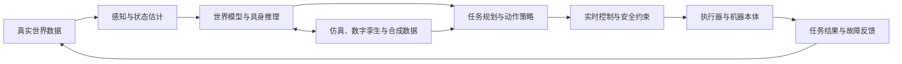
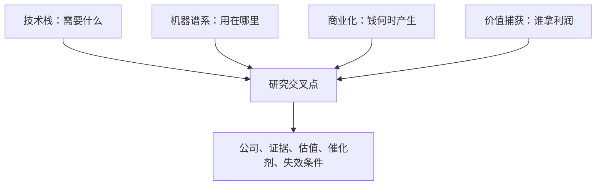

# 物理 AI 长期研究框架

版本：1.0  
建立日期：2026-07-29  
定位：长期维护的研究母版，不随单日行情和概念热度变化。  
配套文件：

- `config/physical_ai_taxonomy.csv`：机器可读的产业节点树。
- `config/physical_ai_embodiments.csv`：机器类别、任务和商业化指标表。
- `reports/physical_ai_global_map_20260729.md`：截至 2026-07-29 的公司与产业状态快照。
- `reports/physical_ai_global_industry_research_20260724.md`：第一版产业研究。
- `reports/physical_ai_company_deep_dive_20260724.md`：第一轮公司横向比较。

## 一、研究对象

物理 AI 不是人形机器人的同义词。它研究的是能够感知物理世界、理解任务、规划动作、控制实体并从结果中继续学习的系统。

一个完整闭环是：



研究的核心不是“哪台机器人最像人”，而是回答五个问题：

1. 哪类任务最先达到经济可用？
2. 哪个环节限制了可靠性、成本或规模？
3. 谁掌握难以替换的技术、数据、客户入口或认证？
4. 收入处于演示、送样、试点还是重复采购阶段？
5. 当前价格是否已经支付了远期成功的大部分价值？

## 二、总研究地图

物理 AI 需要同时叠加四张图，单看任意一张都会失真。

### 图 A：技术栈

回答“机器需要什么”。从数据、模型、算力、感知、控制、执行器、能源，到制造、集成和运维，逐层定位价值量和瓶颈。

### 图 B：机器与任务谱系

回答“技术用在哪里”。同一套视觉、控制或执行器，在工业臂、AMR、人形机器人、手术机器人和工程机械里的认证、成本与商业模式完全不同。

### 图 C：商业化生命周期

回答“钱何时产生”。演示视频、客户送样、设计定点、付费试点、批量订单、重复采购和存量服务收入是不同等级的证据。

### 图 D：价值捕获与估值

回答“利润由谁拿走”。技术不可替代不等于公司能提价，公司能增长也不等于股票值得买。必须把产业瓶颈、竞争格局、收入纯度、资本强度和估值放在一起。



## 三、因果链：为什么是现在

### 3.1 需求侧

- 劳动力短缺、老龄化、高危作业和重复劳动提高自动化的替代价值。
- 电商物流、柔性制造、半导体、汽车、医疗等场景已经能量化吞吐、良率、停机时间和人工成本。
- 客户越来越需要可快速换线、可处理长尾任务的柔性系统，而不是只适用于固定工序的专机。

### 3.2 供给侧

- 多模态模型开始把语言、视觉、空间理解和动作连接起来。
- 仿真、世界模型和合成数据降低真实采集成本，并覆盖危险或稀有场景。
- 边缘算力提高，使低时延、断网运行和本地安全控制成为可能。
- 运动控制、传感器、电池和精密制造供应链逐步成熟。

### 3.3 真正的正反馈

```text
可量化的高价值任务
  -> 首批付费部署
  -> 产生真实故障和动作数据
  -> 模型、工作流与硬件迭代
  -> 成功率提高、集成时间下降、单位经济性改善
  -> 同场景复制和跨场景扩张
  -> 更大规模的部署数据
```

没有真实部署数据，所谓“数据飞轮”只是推演。研究时必须同时看到机器数量、运行小时、接管率、任务成功率和客户复购。

## 四、技术栈：十二层细分

完整节点以 `config/physical_ai_taxonomy.csv` 为准。下面给出每层的投资含义。

### L0 数据获取与训练基础设施

细分：

- 示教、遥操作、动作捕捉和穿戴式采集。
- 真实机器人轨迹、视频、力觉和触觉数据。
- 数据清洗、标注、回放、版本管理和隐私处理。
- 强化学习环境、评测集、故障与边缘场景库。

关键矛盾：数据数量不是唯一指标，跨本体复用、任务多样性、失败样本质量和数据权利更重要。

跟踪指标：有效轨迹数、人工采集成本、每项新技能所需示范数、跨本体迁移效果、评测覆盖率。

### L1 仿真、世界模型与数字孪生

细分：

- CAD/PLM、工厂数字孪生、物理仿真。
- 机器人仿真、强化学习和 sim-to-real。
- 神经重建、合成数据、可编辑 3D 场景。
- 闭环测试、硬件在环、软件在环和安全验证。

关键矛盾：视觉逼真不等于物理正确。摩擦、碰撞、柔性材料、传感噪声和执行器误差决定仿真能否迁移。

跟踪指标：仿真与真实成功率差距、场景生成速度、客户活跃工程师、软件续费率、仿真进入生产流程的比例。

### L2 模型、规划与机器人软件

细分：

- VLM、VLA、世界模型、动作策略和具身推理。
- 导航、抓取、双臂协同、精细操作和工具使用。
- ROS 2、中间件、技能库、模型压缩和 OTA。
- 安全模型、异常检测、成功判定和人机交互。

关键矛盾：实验室泛化能力必须转化成可预测的任务成功率。工业客户更在意失败后如何恢复，而不是平均演示效果。

跟踪指标：任务成功率、连续无故障任务数、恢复率、接管率、推理时延、模型功耗、适配新任务时间。

### L3 云端训练算力、网络与存储

细分：

- GPU/加速器、服务器、互连、网络和存储。
- 机器人数据湖、训练集群、MLOps 和数据工厂。
- 私有云、边缘云和车队级模型分发。

关键矛盾：机器人训练会增加算力需求，但单一机器人主题对大型算力公司的利润贡献可能仍很小，不能把平台优势直接当作高收入纯度。

跟踪指标：训练算力消耗、物理 AI 客户收入、数据下载和开发者活跃度、平台绑定程度。

### L4 边缘计算与实时电子

细分：

- 边缘 SoC、GPU/NPU、MCU、DSP 和 FPGA。
- 安全岛、实时操作系统、确定性网络和时间同步。
- 机器人控制器、域控制器、远程 I/O 和嵌入式模组。

关键矛盾：峰值 TOPS 不是机器人芯片的充分指标。功耗、时延、抖动、传感器接口、功能安全和长期供货同样重要。

跟踪指标：TOPS/W、控制周期、时延抖动、支持传感器数量、开发周期、量产客户和软件生态。

### L5 感知与状态估计

细分：

- RGB、工业相机、深度/ToF、事件相机。
- 激光雷达、毫米波雷达、超声波。
- IMU、GNSS、编码器、旋变和位置传感。
- 六维力/力矩、触觉、压力、温度和环境传感。
- 传感器融合、标定和机器视觉软件。

关键矛盾：某类传感器是否成为标配取决于任务，而不是整机外形。研究要看单机数量、ASP、认证、校准和价格下降。

跟踪指标：单机价值量、毛利率、客户认证周期、前五大客户占比、降价速度、设计定点和量产份额。

### L6 控制、驱动与功能安全

细分：

- PLC/PAC、运动控制器、CNC 和机器人控制柜。
- 伺服驱动、变频器、电机驱动和制动。
- 安全 PLC、安全继电器、冗余控制和急停。
- EtherCAT、TSN、CAN-FD 和工业网络。
- 机器人网络安全、身份、日志和升级。

关键矛盾：AI 的概率性输出必须被确定性的控制与安全边界约束。能同时理解 AI、运动控制和工业认证的平台更稀缺。

跟踪指标：控制轴数、同步精度、响应时间、安全等级、客户切换成本、软件收入和海外份额。

### L7 执行器与传动

细分：

- 伺服电机、无框力矩电机、空心杯电机和直线电机。
- 谐波、RV、行星减速器和精密齿轮。
- 滚珠/行星滚柱丝杠、直线模组和导轨。
- 液压、气动、电液执行和制动。
- 灵巧手、夹爪、末端工具和快换系统。

关键矛盾：把“单机价值量 × 百万台”直接当收入预测最容易失真。必须加入降价、良率、二供、内制率和真实产能利用率。

跟踪指标：送样/定点/SOP、良率、产能利用率、单位价格、客户内制率、份额、售后更换周期。

### L8 机械结构、材料与连接

细分：

- 轴承、关节支撑、导轨、紧固件和密封润滑。
- 铝镁合金、碳纤维、工程塑料和轻量化结构。
- 线束、连接器、滑环、拖链和柔性电缆。
- 机架、外壳、碰撞结构和热结构一体化。

关键矛盾：这些环节常被忽略，但疲劳寿命、重量、布线可靠性和维护性会决定整机能否长期运行。

跟踪指标：寿命循环、重量下降、单机用量、材料利用率、认证、返修率和供应集中度。

### L9 能源、电源与热管理

细分：

- 电芯、电池包、BMS、充电和换电。
- 功率半导体、DC/DC、逆变、电源模块和高压配电。
- 液冷、风冷、热界面材料和温控部件。

关键矛盾：续航只是表面指标。峰值功率、充电时间、热衰减、循环寿命和安全冗余共同决定可用率。

跟踪指标：Wh/kg、峰值功率、任务续航、充电周转、循环寿命、热降频和每小时能源成本。

### L10 精密制造、测试与认证

细分：

- 机床、磨削、齿轮加工、绕线、压铸和注塑。
- 计量、三坐标、视觉检测、动平衡和可靠性测试。
- 系统安全、医疗、汽车、航空和工业认证。
- EMS、合同制造、供应链追溯和质量管理。

关键矛盾：样机能动和批量稳定交付之间隔着制造工艺、测试覆盖、供应链和认证，不只是扩大厂房。

跟踪指标：节拍、良率、测试覆盖、认证周期、返修率、资本开支强度和产能利用率。

### L11 本体、集成、部署与车队运营

细分：

- 机器人本体和标准化整机。
- 系统集成、场景软件、工装和产线改造。
- 远程运维、车队管理、备件、保险和融资租赁。
- 硬件销售、订阅、按量收费、RaaS、耗材和服务。

关键矛盾：本体收入大不代表利润厚。部署、调试、现场长尾和售后可能吞噬毛利；反过来，服务、耗材和车队软件可形成更好的经常性收入。

跟踪指标：部署数量、每台年运行小时、客户复购、集成天数、毛利率、服务收入占比、RaaS 回收期和流失率。

## 五、机器与任务谱系

研究对象按“任务经济性”分组，而不是把所有机器人混在一起比较。

| 机器类别 | 首要任务 | 当前商业化观察 | 核心约束 |
|---|---|---|---|
| 固定工业机器人 | 焊接、搬运、喷涂、上下料、装配 | 已规模化，是运动控制和机器视觉的基本盘 | 制造业资本开支、换线柔性 |
| 协作机器人 | 机床上下料、装配、检测 | 中小企业渗透仍有空间 | 安全、易部署、渠道和投资回收期 |
| AMR/AGV | 仓内搬运、拣选、补货 | 已形成大规模部署和车队软件 | 调度、场地改造、可靠性 |
| 移动操作机器人 | 移动加抓取、巡检加操作 | 由试点向特定场景扩展 | 导航与精细操作协同 |
| 人形机器人 | 人类空间中的通用搬运和操作 | 多数仍在定点、试点或小批量 | 成本、续航、手部能力、安全和可维护性 |
| 自动驾驶车辆 | 乘用、货运、园区、矿区 | 封闭场景和部分城市运营领先 | 监管、长尾场景、责任和单位经济性 |
| 无人机/eVTOL | 巡检、测绘、物流、国防、载人 | 巡检和国防成熟度高于大众物流 | 空域、续航、载荷和认证 |
| 农业机器人 | 自动驾驶、喷洒、采收、除草 | 大田自动驾驶先行，精细采摘较难 | 非结构环境、季节性和渠道 |
| 工程/矿山机器人 | 运输、挖掘、钻采、远程作业 | 高危和封闭场景价值明确 | 极端环境、停机成本和安全 |
| 医疗机器人 | 手术、康复、影像介入、实验室 | 手术机器人已有成熟商业闭环 | 临床证据、监管、医生学习曲线 |
| 家庭/消费机器人 | 清洁、陪护、整理和服务 | 单任务产品成熟，通用家务仍早期 | 成本、可靠性、隐私和售后 |
| 海洋/太空/国防 | 水下、卫星服务、无人系统 | 任务价值高但采购和监管特殊 | 认证、预算周期、保密和地缘风险 |

### 任务优先级模型

优先研究满足以下条件的任务：

```text
任务价值高
× 环境可约束
× 结果可量化
× 人工成本或风险高
× 部署可复制
÷ 失败代价
÷ 集成复杂度
÷ 监管阻力
```

这通常意味着仓储物流、封闭园区、机器上下料、工业巡检、矿山、手术和实验室自动化会比“通用家庭人形机器人”更早形成稳定收入。

## 六、商业化证据分级

所有公司和产品统一使用 `E0-E6`，防止把新闻、送样和收入混为一谈。

| 等级 | 定义 | 可接受证据 | 不能推导的结论 |
|---|---|---|---|
| E0 概念 | 战略表态、研究方向 | 官网、管理层公开表述 | 产品存在、收入即将发生 |
| E1 原型 | 样机或公开演示 | 产品演示、论文、开发者版本 | 客户愿意付费、可量产 |
| E2 测试 | 送样、联合开发、内部测试 | 客户或供应商正式披露 | 已定点、形成订单 |
| E3 定点/试点 | 设计定点、付费试点、现场验证 | 客户合同、正式公告、双方披露 | 已批量交付、盈利 |
| E4 小批量 | 小批交付或收入开始确认 | 财报、订单和交付数据 | 可持续复购、规模盈利 |
| E5 重复订单 | 多客户或同客户重复采购 | 连续财报、复购和扩产利用率 | 已形成平台垄断 |
| E6 规模闭环 | 大规模装机并有服务/耗材/软件收入 | 装机、利用率、经常性收入和现金流 | 估值一定便宜 |

证据优先级：

```text
监管披露/审计财报
> 客户与供应商双方正式披露
> 单方公告或投资者关系材料
> 行业协会与标准组织
> 高质量媒体
> 券商和第三方数据库
> 社交媒体、产业传闻
```

## 七、收入纯度与价值捕获

### 7.1 收入暴露度

| 等级 | 定义 |
|---|---|
| R0 | 只有主题叙事，没有可识别业务 |
| R1 | 技术或产能期权，尚无明确客户收入 |
| R2 | 相邻业务受益，物理 AI 不是独立收入来源 |
| R3 | 直接收入低于集团收入 10% |
| R4 | 直接收入约占集团收入 10%-30% |
| R5 | 直接收入超过 30%，或公司基本属于物理 AI 纯标的 |

收入纯度低不等于公司差，但估值时不能把集团全部利润都按机器人高倍数定价。

### 7.2 价值捕获六问

1. 产品是否不可替代，还是只在早期供不应求？
2. 客户切换需要重新设计、认证或停线吗？
3. 公司能否保留降本收益，还是全部让利给整机厂？
4. 软件、耗材、服务或数据能否形成经常性收入？
5. 扩产需要多少资本，产能空置时损失多大？
6. 客户是否会内制，或引入第二供应商压价？

### 7.3 瓶颈分数

每个节点按 0-5 分评估：

- 供应集中度。
- 扩产周期。
- 工艺与良率难度。
- 客户验证周期。
- 替代难度。
- 需求增长确定性。

`瓶颈分高` 只说明研究优先级高，不直接等于股票回报高。最终还要经过经营质量和估值门。

## 八、估值框架

### 8.1 三段式拆分

每家公司都拆成：

1. **存量主业价值**：按正常周期和可持续利润估值。
2. **已验证物理 AI 业务**：只计入 E4-E6 的收入和合理增长。
3. **远期期权**：E0-E3 采用概率加权，避免同时抬高盈利预测和估值倍数。

### 8.2 不同商业模式的估值锚

| 类型 | 优先指标 | 补充指标 |
|---|---|---|
| 成熟工业部件 | 周期中枢 PE、EV/EBIT、ROIC | 产能利用率、库存和订单 |
| 高质量传感/工控 | PE、FCF yield、ROIC | 续费、客户集中、海外份额 |
| 软件与仿真 | EV/Sales、FCF、净收入留存 | 经常性收入、客户扩张 |
| 亏损本体公司 | EV/Sales、净现金、现金消耗 | 订单质量、毛利和交付 |
| RaaS/车队运营 | 单位经济性、回收期、LTV/CAC | 利用率、流失率、服务成本 |
| 医疗机器人 | 装机、手术量、耗材和服务收入 | 监管、临床采用和竞争装机 |
| 综合平台公司 | 分部估值/SOTP | 物理 AI 收入纯度和资本配置 |

### 8.3 估值硬门

- 不因为赛道大就接受无限估值。
- 远期销量必须包含概率、时间、降价、稀释和竞争。
- 对没有收入披露的机器人业务，只给有限期权价值。
- 高资本开支公司必须验证自由现金流，而不是只看毛利。
- 所有估值快照必须标注日期、币种、股价来源和口径。

## 九、公司研究记录结构

每家公司至少保留以下字段：

| 字段 | 含义 |
|---|---|
| `company_id` | 稳定公司标识 |
| `company_name` | 公司名称 |
| `ticker_exchange` | 代码和交易所 |
| `country_region` | 注册或主要经营地区 |
| `node_ids` | 所在产业节点，可多选 |
| `embodiment_ids` | 对应机器类别，可多选 |
| `evidence_level` | E0-E6 |
| `revenue_exposure` | R0-R5 |
| `commercial_stage` | 演示、测试、试点、小批量、重复订单、规模闭环 |
| `primary_source` | 最强一手来源 |
| `source_date` | 来源日期 |
| `physical_ai_revenue` | 已披露直接收入 |
| `bottleneck_score` | 瓶颈评分 |
| `moat_tags` | 技术、数据、渠道、认证、成本、生态 |
| `valuation_date` | 估值截止日 |
| `valuation_method` | PE、EV/Sales、SOTP、DCF 等 |
| `catalysts` | 可验证催化剂 |
| `invalidation` | 论文失效条件 |
| `next_check_date` | 下次检查时间 |

## 十、节点指标字典

| 节点 | 最重要的领先指标 | 最重要的结果指标 |
|---|---|---|
| 模型/VLA | 开发者、模型发布、跨本体合作 | 付费部署、任务成功率、接管率 |
| 仿真/数字孪生 | 场景和客户接入 | 软件收入、续费、部署周期下降 |
| 边缘算力 | 设计定点、开发套件和生态 | 量产芯片收入、单机 ASP、毛利 |
| 传感器 | 客户验证、单机数量 | 量产份额、ASP、毛利和复购 |
| 运动控制 | 新客户和新轴数 | 收入、海外份额、控制器附加率 |
| 减速器/丝杠 | 送样、定点、产能和良率 | SOP、利用率、单价、份额 |
| 本体 | 付费试点、订单和集成时间 | 交付、复购、毛利、运行小时 |
| RaaS | 签约和部署速度 | 利用率、回收期、流失率、FCF |
| 医疗机器人 | 获批、装机和培训医生 | 手术量、耗材、服务和经常性收入 |
| 自动驾驶 | 无安全员里程、运营区域 | 单车利用率、事故率、单位经济性 |

## 十一、研究输出层级    3

### 11.1 母版

本文件只维护定义、分类、证据、指标和工作流。除非研究方法改变，不频繁修改。

### 11.2 产业快照

按季度或重大事件更新：

- 技术路线变化。
- 产业并购和所有权变化。
- 商业化等级升级或降级。
- 关键节点的供需和价格变化。
- 全球公司研究池。

### 11.3 公司深挖

只对通过第一轮筛选的公司做：

- 产品和客户。
- 财务质量和资本配置。
- 物理 AI 收入纯度。
- 竞争优势。
- 估值区间。
- 催化剂与失效条件。

### 11.4 事件更新

财报、订单、量产、监管、事故、并购等事件只更新证据状态，不轻易重写长期论文。

## 十二、研究优先顺序

### 第一组：已经形成商业闭环

先研究能提供现实基准的公司和场景：

- 手术机器人。
- 仓储和物流车队。
- 工业机器人、协作机器人和机器视觉。
- 封闭园区、矿山和农业自动驾驶。

这些场景告诉我们真实的毛利、售后、装机、利用率和客户复购应是什么样。

### 第二组：从试点进入复制

- 移动操作机器人。
- 工业巡检。
- 机器人边缘计算和实时控制平台。
- 高价值柔性装配。
- 半导体与实验室自动化。

这一组最可能在未来两三年形成收入拐点。

### 第三组：高弹性但证据较弱

- 通用人形机器人。
- 灵巧手和高自由度执行器。
- 家庭通用机器人。
- 大众 eVTOL 和开放道路 L4。

这一组适合建立证据跟踪，不宜仅凭 TAM 给高估值。

## 十三、下一轮专题树

建议按以下顺序继续，每一项都形成独立报告：

1. **任务经济学**：选 20 个任务，比较人工成本、机器人价格、成功率、回收期和监管。
2. **实时控制与边缘大脑**：NVIDIA、Qualcomm、NXP、Renesas、Infineon、TI 等平台比较。
3. **机器人数据工厂**：真实采集、遥操作、仿真、世界模型和闭环评测。
4. **感知栈**：视觉、深度、力觉、触觉、编码器和安全传感的单机价值量。
5. **执行器树**：电机、驱动、减速器、丝杠、液压、灵巧手的技术路线和量产瓶颈。
6. **工业部署入口**：Siemens、Rockwell、FANUC、Yaskawa、汇川等谁更有客户和控制入口。
7. **成熟商业样板**：Intuitive Surgical、Amazon Robotics、Symbotic、John Deere 等。
8. **人形机器人证据表**：逐家区分原型、试点、付费、交付、运行小时和复购。
9. **全球上市公司估值表**：统一币种、财务期和物理 AI 收入纯度，建立可比公司组。
10. **中国供应链实证**：只保留能找到送样、定点、SOP 或收入证据的公司。

## 十四、研究纪律

- 概念相关性与收入相关性分开。
- 供应商口径与客户口径交叉验证。
- 订单额、框架协议、产能规划和确认收入分开。
- 当前主业与机器人远期期权分开估值。
- 未上市关键公司照样进入产业图，但标注“不可直接交易”。
- 并购中的业务单独标注交易状态，不能沿用旧的上市公司映射。
- 所有重要数字必须有日期和来源；无法核实就明确写“未知”。
- 先寻找反证，再写结论。

## 十五、一手资料入口

- [NVIDIA 2026 Physical AI 研究工具与 Cosmos 3](https://blogs.nvidia.com/blog/cvpr-physical-ai-research-agent-skills/)
- [Google DeepMind Gemini Robotics 1.5](https://deepmind.google/en/models/gemini-robotics/gemini-robotics/)
- [Google DeepMind Gemini Robotics-ER 1.6](https://deepmind.google/blog/gemini-robotics-er-1-6/)
- [Qualcomm Dragonwing IQ10 机器人平台](https://www.qualcomm.com/news/releases/2026/01/qualcomm-introduces-a-full-suite-of-robotics-technologies-power)
- [Siemens 工业物理 AI 与 Eigen Engineering Agent](https://press.siemens.com/global/en/pressrelease/siemens-brings-ai-physical-world-eigen-engineering-agent)
- [IFR World Robotics 2025](https://ifr.org/worldrobotics/report-2025)
- [IFR 2025 服务机器人摘要](https://ifr.org/img/worldrobotics/Executive_Summary_WR_2025_Service_Robots.pdf)
- [ISO 10218-1:2025 工业机器人安全](https://www.iso.org/standard/73933.html)
- [ISO 机器人标准目录](https://www.iso.org/cms/live/live/en/sites/isoorg/home/sectors/engineering/robotics.html)
- [Amazon 百万台机器人与 DeepFleet](https://www.aboutamazon.com/news/operations/amazon-million-robots-ai-foundation-model)
